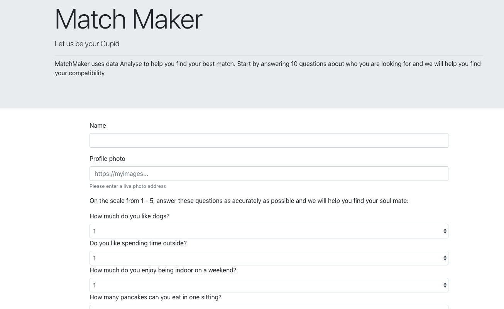

# MatchMaker


The goal was to create a Match Maker app (essentially a dating app but for friends) using Node and Express servers. The user enters the page that leads to a survey. When the user submits the survey, they are matched with a "friend" that has the closest match to their personality.

# Challenges Encountered

Is the functionality and the math in calculating the best match.
Once users send in their input these numbers are generated into arrays of results and it will then be compared to those of preexisting entered users. Not only that this homework requires the understanding of how front end making a request to back end, it is also the routing among the pages that was a difficult concept to comprehend. To compare an array with multiple other arrays of objects requires a nested loop. I did a absolute math to find the differences between the just input array and the first array then put alll the comparisons mathematic results into a new array and from there find the closest math. 
This logic gets rid of the matching with oneself as long as there are more than two members who have entered their information

## Getting Started
https://findyoursoulm8.herokuapp.com/

## Screen Shots


survey page


popup match

## Technologies used
- Node.js
- body-parager NPM Package - https://www.npmjs.com/package/inquirer
- express NPM Package - https://www.npmjs.com/package/express
- path NPM Package - https://www.npmjs.com/package/path

### Prerequisites

```
- Node.js - Download the latest version of Node https://nodejs.org/en/
```

## Built With

* Visual Studio Code
* Bootstrap 4

## Contributor

* **Kimmy Kablitz** - *HTML/JS/Node.js* - [Kimmy Kablitz](https://github.com/kimkablitz)